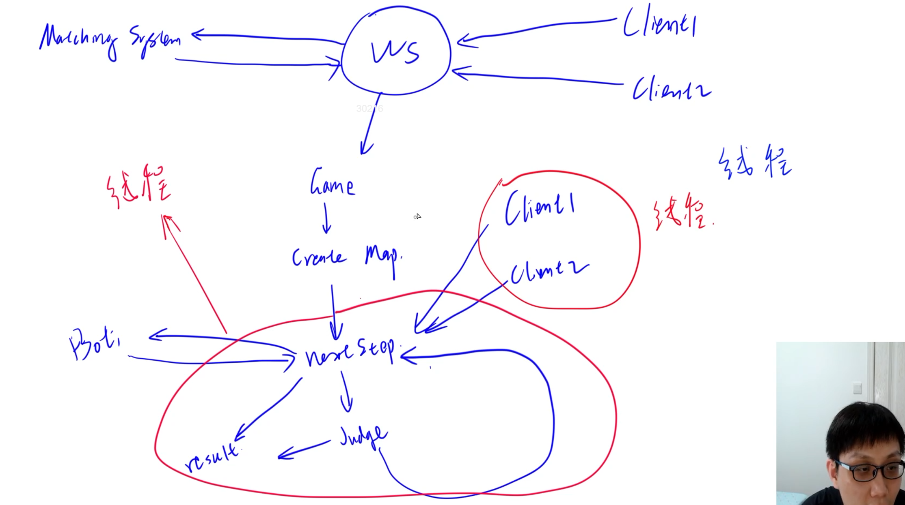

#### 一个伟大的史诗级巨著

# 实现匹配系统(中)

## 1. 同步玩家位置

1. 后端确定玩家的位置，然后传到前端
2. 新建一个Player类，存储玩家id，起点位置，走过的路径。后端把生成的Player数据传到前端
3. 匹配成功之后，两个前端+一个后端，就会有三个棋盘，如何这三个状态同步

## 2. 把Game变成多线程的一个类

1. 在java中，让Game继承自Thread类，重载run函数
2. 启动一个线程之后，需要执行什么操作呢？都需要等待下一步操作，因此实现函数nextStep()
3. 两个Client线程会写入nextStep()函数，Judge线程会读取，这个时候就需要加锁了
4. 在等待两名玩家输入操作的时候，因为前端200ms才会移动一次，因此后端每次再读入用户输入前，需要睡眠200ms，否则后边的输入会覆盖掉前边的输入。
5. 13*14个格子，不到200，每三步长一格，两条蛇加一起600步，1000够了

## 3. 前后端的通信

